# Minesweeper Web

A full-stack Minesweeper implementation featuring "First-Click Safety," chording, and a persistent leaderboard.

This project is a rewrite of a terminal-based Java version I created in 2023.

I revisited the core logic in 2025 to clean up the architecture (DDD) and port it to a full-stack web application.

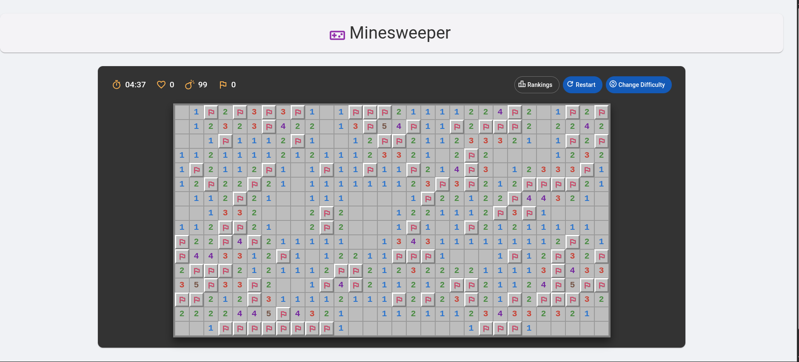

## Project Overview

This project moves the original terminal-based game to a web environment.

To maintain a clean architecture (~~and because I am more comfortable with Kotlin for complicated logic~~), the core game logic resides entirely on the backend, while the frontend focuses solely on rendering the grid state and handling user input.

### Key Features

* **First-Click Safety:** The map is generated *after* your first click, so you never blow up on turn one.
* **Chording:** If you flag the correct number of mines around a cell, clicking the number reveals the neighbors.
* **Second Chance:** Medium and Custom modes give you a "life" system to forgive one mistake.
* **Custom Difficulty:** Configure grid size (up to 30x30) and density.
* **Leaderboard:** Tracks top scores per difficulty in Postgres.
* **Internationalization:** Multi-Language support for English and German.
* **Dark/Light Mode:** Theme switching support based on system preference or user toggle.

## Architecture & Tech Stack

### Backend (Kotlin)

* **Spring Boot 4:** For the REST API and dependency injection.
* **Hexagonal Architecture:** The domain logic (`MinesweeperGame`, `World`, `Block`) is pure Kotlin, isolated from the framework and DB.
* **PostgreSQL:** Stores high scores.
* **Flyway:** Handles database migrations automatically on application startup.

### Frontend (Angular)

* **Angular 21:** Uses **Standalone Components** and **Signals** for state management.
* **Angular Material:** UI components and theming.
* **SCSS:** Custom styling for the grid.

## How to Run (Docker)

The easiest way to run the app is with Docker Compose. You don't need Java or Node installed locally.

1. (Optional) Create a `.env` file in the root directory (see `.env.template` for defaults).
2. Run:
   ```bash
      docker compose up -d
   ```  

3.  Open `http://localhost`.
4.  **Enjoy!**

## How to Run (Local Development)

If you wish to run the backend and frontend services individually without Docker Compose (e.g., for debugging), 
please refer to the [Local Development Guide](docs/local_setup.md).

## Inspiration & Credits

  * **Game Design:** The UI/UX for this web implementation was heavily inspired by **GNOME Mines** 
(the default Minesweeper on Ubuntu/Debian systems). 
A huge thanks to the GNOME team for their clean, functional design.
  * **Icons:** [Google Material Icons](https://fonts.google.com/icons).
  * **Game Logo:** [PNGEgg](https://www.pngegg.com/en/png-idbew).

-----

*Created by Joseph – Nov 2025*

-----

## Gallery

<details>
<summary>Click to view more screenshots</summary>

### Main Menu
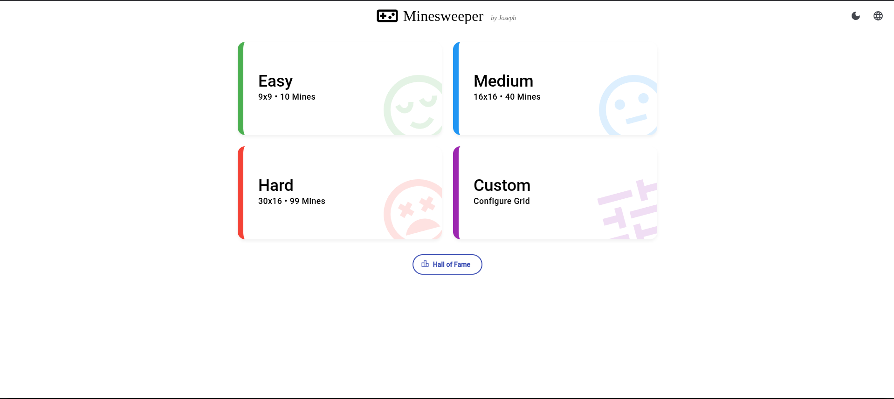

### Dark Mode Menu
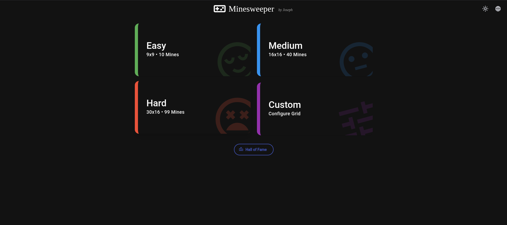

### Leaderboard
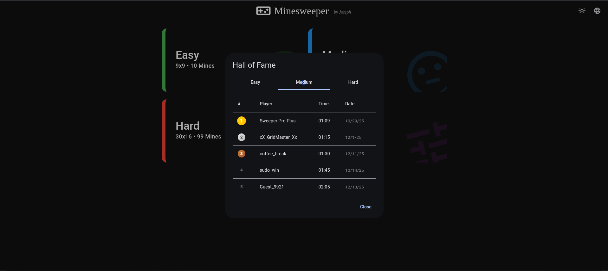

### Leaderboard (empty)
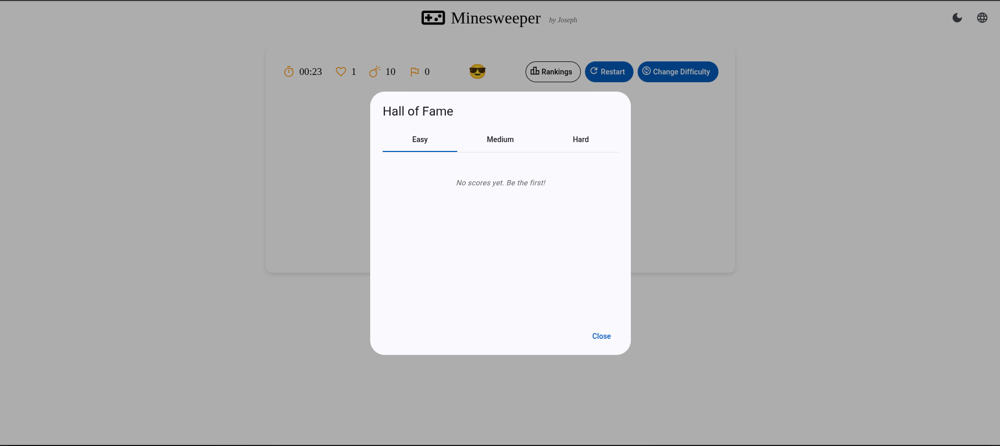

### Start
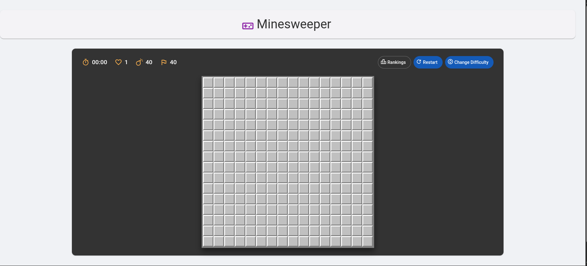

### Mid-Game Snippet
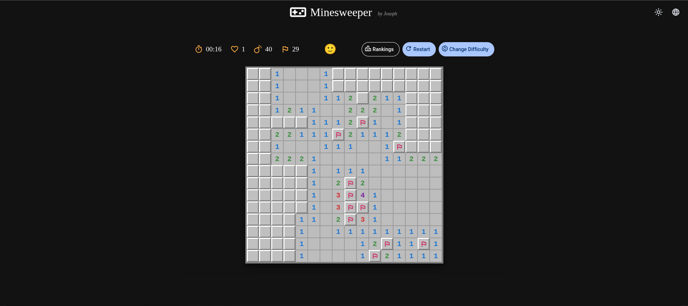

### Exploded (not lost due to extra life)
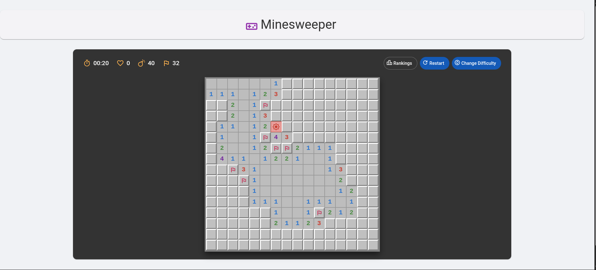

### Exploded (lost)
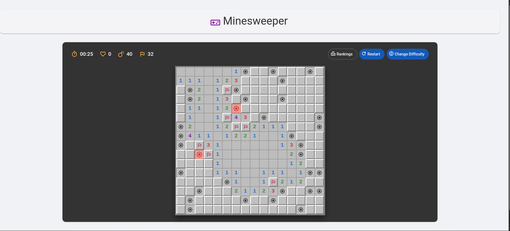

### Victory / Submit


### Custom Diff
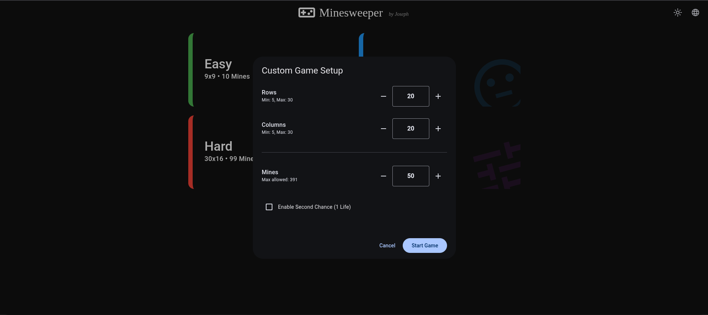

### German Support
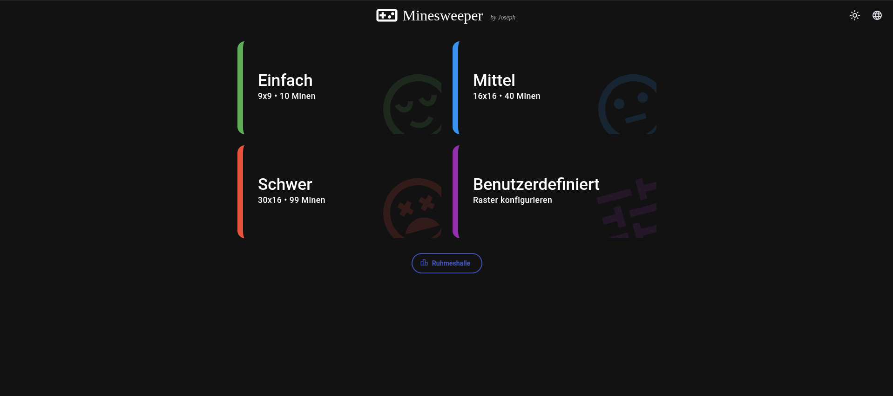

### Dark Mode Gameplay
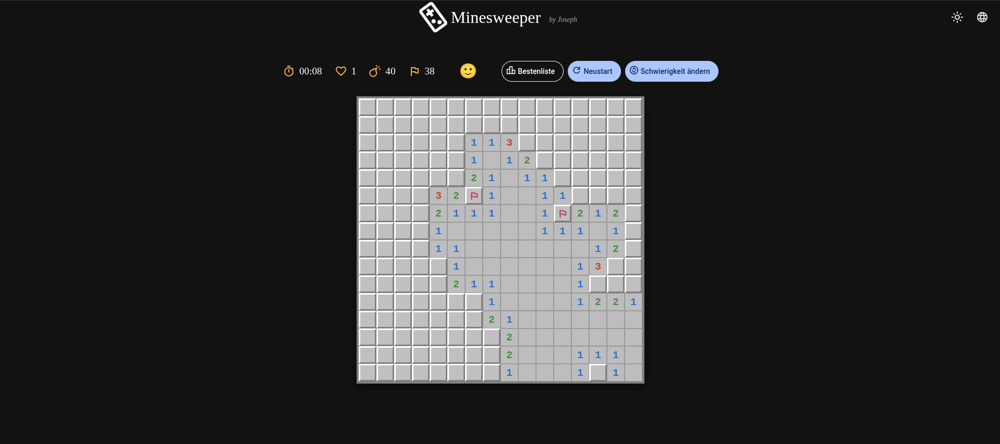

### Restart Confirm
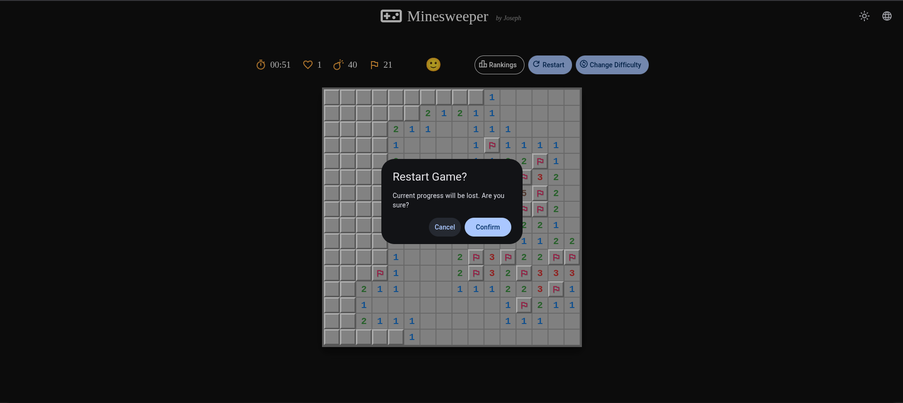

</details>
